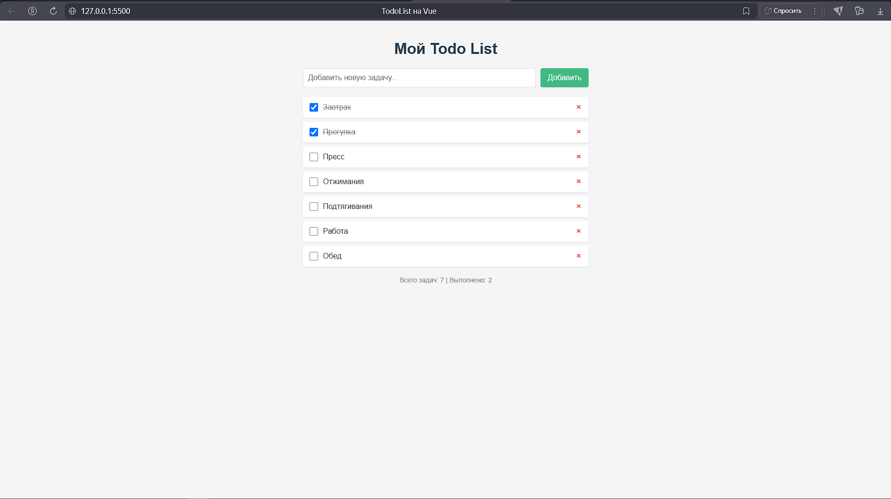

## Простое веб-приложение для управления задачами "Список дел". 
### Описание
Основной функционал: 
- Добавление новых задач.
- Отметка задач как выполненных.
- Удаление задач.
- Статистика:общее количество и выполненные
- Адаптивный дизайн 

### Технические особенности
- Vue.js 3 (Composition API)
- Лёгкий интерфейс
- Реактивное обновление данных

### Запуск проекта
Откройте index.html в браузере:
Двойной клик по файлу 
или через Live Server в VS Code

